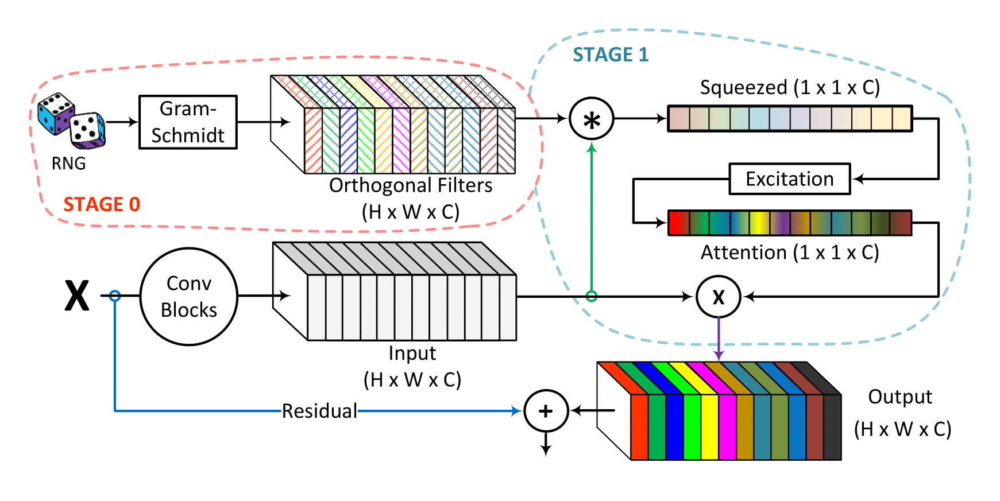

# OrthoNets : Orthogonal Channel Attention Networks
PyTorch's implementation of the paper "[OrthoNet : Orthogonal Channel Attention Networks](-)".



# Install

1. Install Linux 
2. Install Anaconda 
3. Install CUDA 11.X
4. Run the following comands in OrthoNet 
```
conda env create --file orthonet.yaml
conda activate orthonet
pip install --extra-index-url https://developer.download.nvidia.com/compute/redist nvidia-dali-cuda110
```
5. Edit settings.sh if necessary.
    
# Dataset acquisition and installation

If you are installing these datasets for the first time, place them in OrthoNet/datasets. 
Otherwise, please edit settings.sh to set your dataset location.

## Dataset Locations

ImageNet-1000 
```
Visit https://www.image-net.org/ and download ImageNet 2014 Dataset.
```

MS-COCO 
```
Train     Images      : http://images.cocodataset.org/zips/train2017.zip
Val       Images      : http://images.cocodataset.org/zips/val2017.zip
Train/Val Annotations : http://images.cocodataset.org/annotations/annotations_trainval2017.zip
```

Birds
```
Train/Val Images : https://www.kaggle.com/datasets/gpiosenka/100-bird-species/download?datasetVersionNumber=59
```

Places365
```
Train/Val Images : https://www.kaggle.com/datasets/benjaminkz/places365/download?datasetVersionNumber=1
```

# Setting up the models

The models can be found at
```
https://drive.google.com/drive/folders/1N_L7Cy5I2lwVTnjjYan2Z0rXNVw8rN-c?usp=share_link
```
Download the "pretrained_models" folder and place it in OrthoNet. Typically, the files are downloaded in multiple zips. Verify all 14 models are present. 


# Training and Testing

Training and testing the models is done by the run.sh script. The specific commands are found below.


## Testing Pretrained Models

| Method       | Backbone              | Dataset  | Command                                          |
|--------------|-----------------------|----------|--------------------------------------------------|
| OrthoNet     | ResNet-34             | ImageNet | ./run.sh orthonet_34_imagenet                    |
| OrthoNet     | ResNet-50             | ImageNet | ./run.sh orthonet_50_imagenet                    |
| OrthoNet-MOD | ResNet-50             | ImageNet | ./run.sh orthonet_mod_50_imagenet                |
| OrthoNet-MOD | ResNet-50             | Birds    | ./run.sh orthonet_mod_50_birds                   |
| OrthoNet-MOD | ResNet-50             | Places   | ./run.sh orthonet_mod_50_places                  |
| FcaNet       | ResNet-50             | Birds    | ./run.sh fcanet_50_birds                         |
| FcaNet       | ResNet-50             | Places   | ./run.sh fcanet_50_places                        |
| OrthoNet     | ResNet-101            | ImageNet | ./run.sh orthonet_101_imagenet                   |
| OrthoNet-MOD | ResNet-101            | ImageNet | ./run.sh orthonet_mod_101_imagenet               |
| OrthoNet-MOD | ResNet-50/FasterRCNN  | COCO     | ./run.sh orthonet_mod_50_coco_faster_rcnn        |
| OrthoNet-MOD | ResNet-101/FasterRCNN | COCO     | ./run.sh orthonet_mod_101_coco_faster_rcnn       |
| FcaNet       | ResNet-50/MaskRCNN    | COCO     | ./run.sh fcanet_50_coco_mask_rcnn                |
| OrthoNet-MOD | ResNet-50/MaskRCNN    | COCO     | ./run.sh orthonet_mod_50_coco_mask_rcnn          |


## Training Your Own Models

During training, FasterRCNN and MaskRCNN use the pretrained OrthoNet/FcaNet from the pretrained models folder.

| Method       | Backbone              | Dataset  | Command                                          |
|--------------|-----------------------|----------|--------------------------------------------------|
| OrthoNet     | ResNet-34             | ImageNet | ./run.sh orthonet_34_imagenet train              |
| OrthoNet     | ResNet-50             | ImageNet | ./run.sh orthonet_50_imagenet train              |
| OrthoNet-MOD | ResNet-50             | ImageNet | ./run.sh orthonet_mod_50_imagenet train          |
| OrthoNet-MOD | ResNet-50             | Birds    | ./run.sh orthonet_mod_50_birds train             |
| OrthoNet-MOD | ResNet-50             | Places   | ./run.sh orthonet_mod_50_places train            |
| FcaNet       | ResNet-50             | Birds    | ./run.sh fcanet_50_birds train                   |
| FcaNet       | ResNet-50             | Places   | ./run.sh fcanet_50_places train                  |
| OrthoNet     | ResNet-101            | ImageNet | ./run.sh orthonet_101_imagenet train             |
| OrthoNet-MOD | ResNet-101            | ImageNet | ./run.sh orthonet_mod_101_imagenet train         |
| OrthoNet-MOD | ResNet-50/FasterRCNN  | COCO     | ./run.sh orthonet_mod_50_coco_faster_rcnn train  |
| OrthoNet-MOD | ResNet-101/FasterRCNN | COCO     | ./run.sh orthonet_mod_101_coco_faster_rcnn train |
| FcaNet       | ResNet-50/MaskRCNN    | COCO     | ./run.sh fcanet_50_coco_mask_rcnn train          |
| OrthoNet-MOD | ResNet-50/MaskRCNN    | COCO     | ./run.sh orthonet_mod_50_coco_mask_rcnn train    |

## Testing Your Trained Models
| Method       | Backbone              | Dataset  | Command                                          |
|--------------|-----------------------|----------|--------------------------------------------------|
| OrthoNet     | ResNet-34             | ImageNet | ./run.sh orthonet_34_imagenet test               |
| OrthoNet     | ResNet-50             | ImageNet | ./run.sh orthonet_50_imagenet test               |
| OrthoNet-MOD | ResNet-50             | ImageNet | ./run.sh orthonet_mod_50_imagenet test           |
| OrthoNet-MOD | ResNet-50             | Birds    | ./run.sh orthonet_mod_50_birds test              |
| OrthoNet-MOD | ResNet-50             | Places   | ./run.sh orthonet_mod_50_places test             |
| FcaNet       | ResNet-50             | Birds    | ./run.sh fcanet_50_birds test                    |
| FcaNet       | ResNet-50             | Places   | ./run.sh fcanet_50_places test                   |
| OrthoNet     | ResNet-101            | ImageNet | ./run.sh orthonet_101_imagenet test              |
| OrthoNet-MOD | ResNet-101            | ImageNet | ./run.sh orthonet_mod_101_imagenet test          |
| OrthoNet-MOD | ResNet-50/FasterRCNN  | COCO     | ./run.sh orthonet_mod_50_coco_faster_rcnn test   |
| OrthoNet-MOD | ResNet-101/FasterRCNN | COCO     | ./run.sh orthonet_mod_101_coco_faster_rcnn test  |
| FcaNet       | ResNet-50/MaskRCNN    | COCO     | ./run.sh fcanet_50_coco_mask_rcnn test           |
| OrthoNet-MOD | ResNet-50/MaskRCNN    | COCO     | ./run.sh orthonet_mod_50_coco_mask_rcnn test     |
